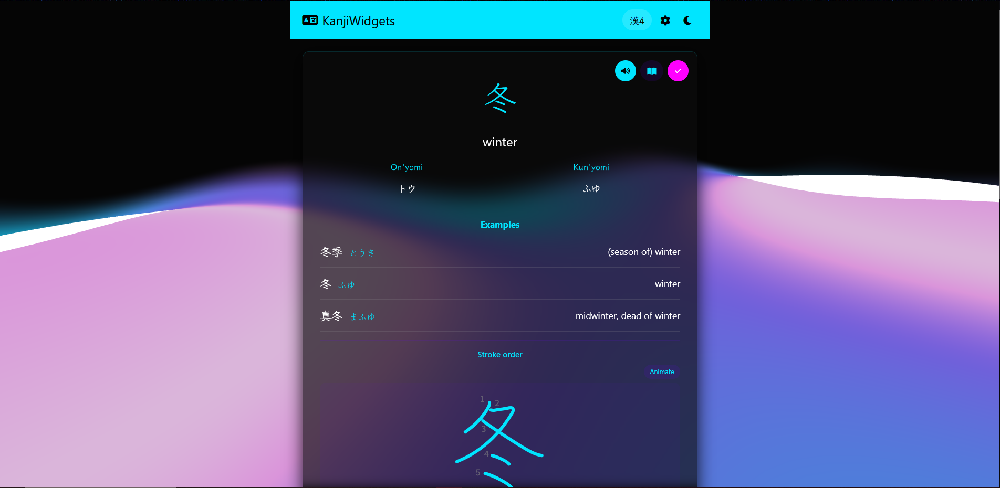

# [KanjiWidgets](https://brodante.github.io/kanji-widget-app/)

A Japanese learning app I built because I got tired of switching between five different apps just to review kanji, hear the pronunciation, and track what I'd actually learned. It's plain HTML/CSS/JS. No framework, no build step. Runs entirely in the browser.



## What it does

- Covers Hiragana, Katakana, and JLPT N5 through N1 (that's around 2,200 kanji plus the kana sets)
- Native-ish audio for every reading, with a fallback chain: Kanji Alive API first if you set one up, Google Translate TTS next, then the browser's built-in speech synthesis as a last resort so it never just goes silent
- Stroke order animations so you can actually see how a character is supposed to be drawn, not just stare at the finished shape
- A dictionary view for each level. Mastered characters show up clearly, everything else stays greyed out until you've studied it, and tapping any of them jumps straight there
- Search that understands more than exact matches. Type a kanji, an English meaning, a kana reading, or even romaji (typing `ima` finds 今) and it'll find it
- Progress tracking: streaks, mastered/pending counts, a "recently studied" list scoped to whatever level you're currently on
- A theme system with about a dozen built-in themes, some with actual animated backgrounds (there's one with a slow-drifting starfield and shooting meteors), plus a full custom theme builder where you can upload your own background image, adjust its blur, pick or auto-extract an accent color from the image, and even drop in your own CSS if you want to go further
- Local backup/restore as JSON, so your progress isn't trapped in one browser

## Running it

No build process, no dependencies beyond Node if you want the dev server:

```bash
git clone https://github.com/brodante/kanji-widget-app.git
cd kanji-widget-app
npm install
npm start
```

Or just open `index.html` directly in a browser. It'll work, though serving it locally avoids some CORS quirks with the audio.

Heads up: the audio files aren't in this repo, they'd add well over 100MB. See `AUDIO-SETUP.md` for how the fallback audio works and how to plug in your own Kanji Alive API key if you want the higher quality pronunciations.

## How it's put together

Everything lives in a handful of files: `script.js` for the app logic, `styles.css` for every theme, `index.html` for the structure, plus small dedicated modules for storage (`storage-manager.js`) and audio (`audio-manager.js`). Kanji/kana data sits in `database/` as plain JSON, one file per level. It's a PWA, so it installs and works offline once you've loaded it.

I've been going through it piece by piece, fixing bugs, cleaning up dead code, adding features, rather than rewriting it all at once. Some of it's still rough around the edges. That's fine, it's a side project.

There's also a rough plan floating around for an actual Android app (native Kotlin, not just a wrapper) at some point. See `android-setup.md` for early notes.

## Credits

Stroke order data comes from [KanjiVG](https://kanjivg.tagaini.net/). Optional premium audio and etymology data comes from the [Kanji Alive API](https://kanjialive-api.p.rapidapi.com/). Some dictionary references point back to [Jisho.org](https://jisho.org/).

## License

GPLv3. See `LICENSE`.

---

Made with 愛 by [d4nte](https://github.com/brodante).

### Google Drive backup

The header Account & sync menu shows guest/Google account status and supports safe
foreground multi-device sync with cloud-change review.
Settings → Backup & Data supports Google account authorization, full Drive backups,
scheduled uploads while the app is open and authorized, history, download and restore.
The site owner must configure a public Google OAuth client ID first.
See [GitHub Pages / Google Drive setup](docs/google-drive-backup.md) for domain setup,
privacy details and browser-only scheduling limits.

Quick save reuses safe cloud checkpoints and skips unchanged data. Create new backup
keeps an independent snapshot; connecting Google only checks the cloud state. Update
all devices to the checkpoint-enabled version before using multi-device sync.

See the [account and cloud-save roadmap](docs/account-sync-roadmap.md) for the full
Must / Should / Could / Optional checklist, implemented safeguards, and remaining
live Google Drive acceptance tests.

Open Account → **My profile** for profile editing, learning statistics and save controls
without leaving the app. The checkpoint diagnostic displays its loaded build and run
time; verify `login-v1` before reporting a new diagnostic result.

Settings now includes profile and section shortcuts. Imports of known v1/v2 exports use
the same validated, recovery-protected restore path as current backups.

### Persistent Google app sign-in (Firebase Spark)

Persistent app sign-in is implemented separately from Google Drive permissions. The owner's public `kanji-widgets` project configuration is now in `firebase-config.js`. Google sign-in has been confirmed working by the owner. See [Firebase setup and phased plan](docs/firebase-auth-setup.md) for the exact free-plan setup steps and verification checklist.

### Email, username and password sign-in

The account menu and Profile page open one sign-in dialog with **Sign in** and
**Create account** tabs. Password accounts need an email and choose a unique
username; the username can also be used to sign in. Availability is checked while
typing, and the reservation document in Firestore, not the browser, decides who owns
a name. Google accounts can add a password, and password accounts can link Google,
without ever merging two accounts by email.

Username-only accounts keep no mailbox: their identifier resolves to a private alias
address, so password recovery for them is honestly refused until a recovery email is
added from Profile. Passwords, reset links and session tokens stay with the Firebase
SDK and are never written to backups or cloud sync.

Enable the Email/Password provider, publish the updated security rules and keep the
project on Spark. See [Email, username and password sign-in](docs/username-login-setup.md)
for the setup steps, the Firestore layout and what still needs a real-project check.

Keep the project on **Spark with no billing account linked**. Google login does not require moving the site off GitHub Pages. The new Firestore progress-sync layer requires published rules and first-sync consent. It does not renew Drive access. Signing out of the app does not disconnect Drive; both controls are explicitly labeled. Firebase session credentials are excluded from learning backups. Real Firestore and two-device verification remain pending.

### Firestore progress sync

The default progress-saving flow now uses Google app sign-in plus Firestore, not Drive. Follow [Firestore setup and verification](docs/firestore-sync-setup.md) and publish the owner-only `firestore.rules` before testing. The database is in Singapore. First sync asks which progress to keep; approved changes save at 30-second intervals while the app is visible and online. New remote revisions pause for review instead of silently replacing local progress. Uploaded media and AI credentials stay local. Drive full backups remain under Settings → Advanced: optional Google Drive backups.

`npm test` covers application behavior with a mock adapter. `npm run test:rules` separately exercises security rules in a demo-project emulator and needs Java 21+. That emulator could not run in the sandbox, so security-rule execution and real two-device acceptance are still pending. Keep Firebase on Spark without billing.

### Development checks

Use Node **22.22.2 or newer in the Node 22 line**, or a newer Node release supported by JSDOM. Run `npm ci` and `npm test` to check the learning/account/sync behavior and the live drawing-pad regression suite together. `npm run test:drawing-pad` runs the practice checks alone. CI runs the combined tests so account work cannot silently drop practice coverage.

### Website analytics

The existing GA4 stream (`G-Q6XNG2ETFL`) remains the sole Analytics destination configured by the app. `analytics.js` loads it only on the production custom domain and this project's GitHub Pages URL, not localhost or previews. Firebase Analytics is not separately initialized. See [Analytics setup and release check](docs/analytics.md).
